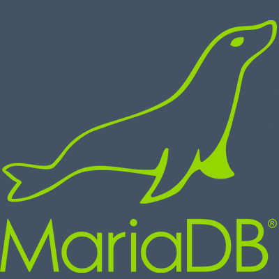

# Hello world!

Hi,
My name is Meilky add I realy love coding and build project with my friends.

Am a big fan of the [open source](https://en.wikipedia.org/wiki/Open-source-software_movement) mouvement
and that's why I use [neovim](https://github.com/neovim/neovim) as my main editor

I use [Linux](https://github.com/torvalds/linux) as my main operating system.

To know more about my workflow, go see my [dotfile](https://github.com/Meilky/dotfiles)

## My stack

My favorite stack of the moment is :
 -  [TypeScript](https://github.com/Microsoft/TypeScript)
 -  [Node.js](https://github.com/nodejs/node)
 -  [React.js](https://github.com/facebook/react)
 -  [MariaDB](https://github.com/MariaDB/server) (SQL)

As server operating system, I use [Debian](https://wiki.debian.org/) long term support.

## Some of my work

Here is my current project:

### Npio

[Npio](https://github.com/Meilky/npio) is a (neo)vim plugin 
that wrap the [platform io](https://docs.platformio.org/en/latest/core/index.html?utm_medium=core&utm_source=github) cli.
It's build in TypeScript and will help you a lot for your arduino project

## Here's my stats

